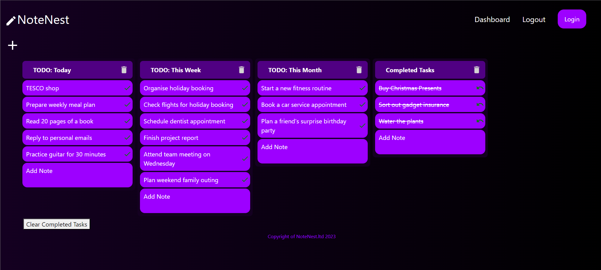

# NoteNest

### A Trello-like note taking app.

## Summary

NoteNest is an interactive notetaking app designed to support the 
organisation of tasks. It provides the user an interactive notes 
dashboard that utilises drag and drop for notes to reorder within
each note section and between sections. 

- Users can create an account and login
- Add up to 6 note sections
- Add notes two these sections
- delete the section
- delete the note 
- mark the note as complete (putting a line through it)
- clear completed tasks. This creates a completed tasks list if one does not already exist, and moves all notes marked as complete here.
- Edit existing notes 

## Tech Used 
### Backend 
**Python's** **Django** framework is used for backend alongside **Django's 
Restframework**. 

#### Models
Models are created using an SQLite3 database and include: 
- custom user model 
- superuser model
- Note section model
- Note model 

#### Authentication

Authentication is carried out using JWT tokens. These tokens
carry a refresh token and access token. The refresh allows for
users to remain logged in over different sessions. They are stored
in local storage allowing the frontend to recall user details
and access tokens on future occasions. They can be used to request
a new access token from the backend, and have a long (several month)
expiration date. 

Access tokens are stored in redux state management along with user 
details that are provided within the encoded access token. They authenticate
requests to the backend API's allowing the transfer of user-related data.

**REFORM**: *JWT tokens are something I would avoid using
in future projects due to potential security issues of storing 
refresh tokens in local storage. While there exists literature for
and against JWT token security, any error on implementation 
does create security risks. **O'Auth** should be used in future
projects for greater security but also to improve user experience, 
such as being able to login with an existing Google account.*

#### APIs
I utilise Django's RestFramework for decorators such as api_view and returning 
response using Response(). Furthermore, in some circumstances, rest_framework.views
is used to create class based views from APIVIEW. 
Django's built in JsonResponse is also utilised for more
basic confirmation of post requests that do not require a return of data. 

Finally, rest_frameworks serializers is was crucial for these apis and sending JSON
data from models. 

### Frontend
The frontend is built using React.js and uses Redux for state management. All HTML is
within React components with CSS having separate files. Bootstrap is used for grid and flex
structuring, combined with some manual CSS overriding for minor adjustments.

The project is split into:
- App.js: React Router for all pages.
- Pages: contains all jsx files for each site page and imports the required components.
- Components: all React elements used within pages. These are layered and import from more nested folders.
- App: main redux store
- Assets: holding images
- Services: apis folder, slices folder (redux), utilities folder

#### Redux 
Redux is used the manage the applications state including user details, user note section data, 
and carry out actions (using reducers) to alter the state of data before sending confirmation
to the backend. 

I have used redux due to the need to access user information in different parts of the application.
Furthermore, it has been useful in gaining access to the users note section data in different
areas of the app, and have a structures way to carry out adjustments. 

I originally built the state management using useContext() and many useState() react hooks. While
useState is still used for specific actions evolving a single page, redux has reformed the process 
and made the project much more expendable in the future. This also massively improved interactions 
with DnD-kit (for drag and drop functionality of the notes within and between note sections).

#### Authentication
Redux manages state with an authentication slice. This slice sets the initial structure of a user,
and has a login async thunk api allowing for users to enter user details (email, password) and receive
a JWT token for access and refresh. The access token is decoded and contains user details which are stored
in the redux auth state. The token itself is also stored there, which is used for future calls of other thunk
apis to gather other aspects of user data, such as their note sections. The authSlice contains a logout user 
reducer that removes the user and access token from state.

The refresh token is stored in local storage and used to refresh
the access token at set intervals of 20 minutes using the RefreshAuthentication.js 
in the apis folder. App.js uses a useEffect() hook and setInterval() refresh the 
access token and replace this in the redux auth state. 

The authSlice also contains the "extraReducers" which creates the process for handling calls from
the login user async thunk api.

#### Main Notes Dashboard 
The UserDashboardPage.js connects all aspects of the user notes dashboard. All note section related async thunk apis 
to actions within the page. It has a simple HTML return, but this contains the NotesDashboard page if the state contains 
note sections (which are collected from the thunk apis when the page is loaded).

The NoteDashboard maps from the array of note sections gathered from the redux NoteSectionSlice. It also handles all
drag and drop functionality including handleNoteDrag() and handleDragOver() which changes the position of the note
being dragged by the user to either a new position in the section (handleNoteDrag()) or to a another note section
(handleDragOver()). HandleDragOver() works effectively because it changes the section the note belongs to without the 
user letting go of the note being dragged. This allows for seemless transition between sections, where the note can 
slot into any spot of the section without it requiring two separate actions. e.g. the note doesn't need to be dragged
to a new section, and then dragged to the right position. It can be dragged, when over the target section, it changes 
its section value in the redux slice, and as it continues to be moved around, enters the sortableContext of the target section.

Key actions the user can do in the notes dashboard are:
- Add up to 6 note sections
- Add notes two these sections
- delete the section
- delete the note 
- mark the note as complete (putting a line through it)
- clear completed tasks. This creates a completed tasks list if one does not already exist, and moves all notes marked as complete here.
- Edit existing notes 

## Reflections 
### Drag and Drop
This functionality proved to have some difficulties when implementing with redux. This predominately came about
 due to the switch from useContext() to redux mid-project. Redux slices should be build with 
drag and drop-related reducers in mind and vise versa for DnD related code.
Intentional planning and foresight can achieve this. 

### Authentication
JWT tokens are something I would avoid using
in future projects due to potential security issues of storing 
refresh tokens in local storage. While there exists literature for
and against JWT token security, any error on implementation 
does create security risks. **O'Auth** should be used in future
projects for greater security but also to improve user experience, 
such as being able to login with an existing Google account.

